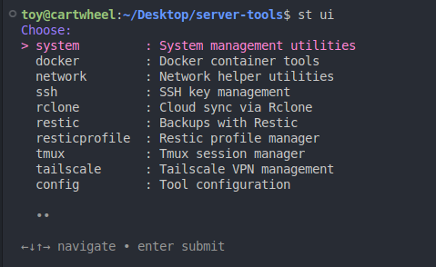
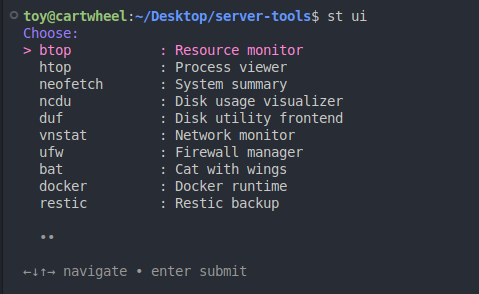
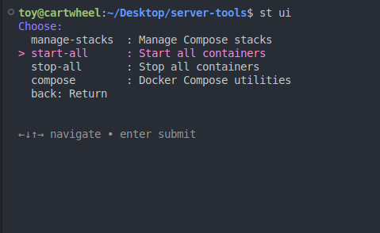

<p align="center"><b><span style="color: red; font-size: 2em;">🚨 WARNING: This project is under active development and may break at any time. Avoid using in production until version 1.0.0! 🚨</span></b></p>

<p align="center">
  
</p>

# Server Tools (`st`)

`st` is a lightweight, modular CLI tool built for managing headless Ubuntu servers with ease — updates, installs, backups, and diagnostics, all in one place.

[](LICENSE)
[](https://bash.sh)
[](https://github.com/Shrikshel/server-tools/stargazers)
[](https://github.com/Shrikshel/server-tools/issues)
[](https://github.com/Shrikshel/server-tools/pulls)

---

## Features

- 🔄 Easy system updates and upgrades
- 📦 Quick install/uninstall for popular utilities (Docker, btop, eza, neofetch, ncdu, duf, vnstat, ufw, bat, rclone, restic, resticprofile)
- 🎨 Colorful, readable output for all commands
- 🧾 System info and health checks
- 💾 Disk usage and SMART status
- 🌐 Network utilities (interfaces, speedtest, public/local IP, Wi-Fi info)
- 🔒 Tailscale VPN management (up, down, status)
- 💬 Telegram integration for notifications and file sending
- 🖥️ Tmux session management (create, attach, list, kill, cheatsheet)
- 🔑 SSH key and connection management
- ☁️ Rclone and Restic backup utilities
- 🧩 Modular and extensible command structure

---


## Table of Contents

- [Server Tools (`st`)](#server-tools-st)
  - [Features](#features)
  - [Table of Contents](#table-of-contents)
  - [Installation](#installation)
  - [Usage](#usage)
    - [Example Commands](#example-commands)
  - [Command Helper](#command-helper)
    - [st docker](#st-docker)
    - [st rclone](#st-rclone)
    - [st restic](#st-restic)
    - [st resticprofile](#st-resticprofile)
    - [st ssh](#st-ssh)
    - [st config](#st-config)
    - [st system](#st-system)
    - [st network](#st-network)
    - [st telegram](#st-telegram)
    - [st tmux](#st-tmux)
    - [st tailscale](#st-tailscale)
    - [st tools](#st-tools)
  - [Configuration](#configuration)
  - [Development](#development)
  - [Requirements](#requirements)
  - [Why use st?](#why-use-st)
  - [Community \& Support](#community--support)
  - [Contributing](#contributing)
  - [Security](#security)
  - [Credits](#credits)
  - [Screenshots](#screenshots)

---

## Installation

```bash
curl -sL https://raw.githubusercontent.com/Shrikshel/server-tools/main/scripts/install.sh | bash
```

To uninstall:

```bash
curl -sL https://raw.githubusercontent.com/Shrikshel/server-tools/main/scripts/uninstall.sh | bash
```

📦 `.deb` package and GitHub Releases coming soon!

---


## Usage

After installation, use the `st` command:

```bash
st [COMMAND] [SUBCOMMAND] [OPTIONS]
```

### Example Commands

```bash
st system update            # Update system packages
st system upgrade           # Upgrade system packages
st system update-upgrade    # Update & upgrade together
st system info              # Show system info
st system disk              # Show disk usage
st system smart             # Show SSD SMART stats
st system install docker    # Install Docker
st system uninstall btop    # Uninstall btop
st reboot                   # Reboot the system
st poweroff                 # Power off the system
st sudosu                   # Switch to superuser mode
```

---

## Command Helper

### st docker

Docker management commands for containers and Compose stacks:

| Description                      | Full Command                      | Alias           |
| -------------------------------- | --------------------------------- | --------------- |
| Docker Related Utilities         | `st docker`                       | `st dc`         |
| Docker Compose Related Utilities | `st docker compose`               | `st dc c`       |
| Manage Docker Compose stacks     | `st docker compose manage-stacks` | `st dc c ms`    |
| Stop all running containers      | `st docker compose stop-all`      | `st dc c stop`  |
| Start all stopped containers     | `st docker compose start-all`     | `st dc c start` |

### st rclone

Rclone utilities for syncing and managing cloud/local storage:

| Description              | Full Command         | Alias      |
| ------------------------ | -------------------- | ---------- |
| Rclone Related Utilities | `st rclone`          | `st rc`    |
| Dry run of rclone sync   | `st rclone dry-sync` | `st rc ds` |
| Perform rclone sync      | `st rclone sync`     | `st rc s`  |
| Perform rclone copy      | `st rclone copy`     | `st rc c`  |

### st restic

Restic backup and restore utilities:

| Description              | Full Command                      | Alias        |
| ------------------------ | --------------------------------- | ------------ |
| Restic Related Utilities | `st restic`                       | `st rs`      |
| List Restic Snapshots    | `st restic snapshots`             | `st rs snap` |
| List Snapshots (full)    | `st restic snapshots --full`      |              |
| Check Restic Repository  | `st restic check`                 | `st rs chk`  |
| Restore from Snapshot    | `st restic restore <id> <target>` | `st rs rst`  |

### st resticprofile

Restic Profile Management:

| Description                      | Full Command                           | Alias      |
| -------------------------------- | -------------------------------------- | ---------- |
| Restic Profile Management        | `st resticprofile`                     | `st rp`    |
| Show Restic Profile Details      | `st resticprofile show <profile>`      | `st rp s`  |
| List Snapshots in Restic Profile | `st resticprofile snapshots <profile>` | `st rp ss` |

### st ssh

SSH key and connection management:

| Description           | Full Command    | Alias    |
| --------------------- | --------------- | -------- |
| SSH Related Utilities | `st ssh`        | `st s`   |
| Generate SSH Key Pair | `st ssh keygen` | `st s k` |

### st config

Manage server tool configuration files:

| Description   | Full Command       | Alias        |
| ------------- | ------------------ | ------------ |
| Config Tools  | `st config`        | `st conf`    |
| Show Config   | `st config show`   | `st conf s`  |
| Edit Config   | `st config edit`   | `st conf e`  |
| Verify Config | `st config verify` | `st conf v`  |
| Source Config | `st config source` | `st conf so` |

### st system

System management utilities for packages, updates, and diagnostics:

| Description               | Full Command                      | Alias                    |
| ------------------------- | --------------------------------- | ------------------------ |
| System Utilities          | `st system`                       | `st sys`                 |
| Update System Packages    | `st system update`                | `st sys upd`             |
| Upgrade System Packages   | `st system upgrade`               | `st sys upg`             |
| Update & Upgrade Packages | `st system update-upgrade`        | `st sys updu`            |
| Show system info          | `st system info`                  | `st sys info`            |
| Show SSD SMART stats      | `st system smart`                 | `st sys smart`           |
| Show disk usage stats     | `st system disk`                  | `st sys disk`            |
| Install Packages          | `st system install`               | `st sys i`               |
| Uninstall Packages        | `st system uninstall`             | `st sys un`              |
| Install All Packages      | `st system install all`           | `st sys i all`           |
| Uninstall All Packages    | `st system uninstall all`         | `st sys un all`          |
| Install Docker            | `st system install docker`        | `st sys i docker`        |
| Install btop              | `st system install btop`          | `st sys i btop`          |
| Install eza               | `st system install eza`           | `st sys i eza`           |
| Install neofetch          | `st system install neofetch`      | `st sys i neofetch`      |
| Install ncdu              | `st system install ncdu`          | `st sys i ncdu`          |
| Install duf               | `st system install duf`           | `st sys i duf`           |
| Install vnstat            | `st system install vnstat`        | `st sys i vnstat`        |
| Install ufw               | `st system install ufw`           | `st sys i ufw`           |
| Install bat               | `st system install bat`           | `st sys i bat`           |
| Install rclone            | `st system install rclone`        | `st sys i rclone`        |
| Install restic            | `st system install restic`        | `st sys i restic`        |
| Install resticprofile     | `st system install resticprofile` | `st sys i resticprofile` |
| Uninstall the above       | `st system uninstall <package>`   | `st sys un <pkg>`        |

### st network

Network helper scripts:

| Description              | Full Command            | Alias          |
| ------------------------ | ----------------------- | -------------- |
| Network Helper Scripts   | `st network`            | `st net`       |
| Show network interfaces  | `st network interfaces` | `st net ifs`   |
| Show link speed          | `st network linkspeed`  | `st net speed` |
| Run a network speed test | `st network speedtest`  | `st net st`    |
| Show public IP address   | `st network publicip`   | `st net pip`   |
| Show local IP address    | `st network localip`    | `st net lip`   |
| Show Wi-Fi information   | `st network wifiinfo`   | `st net wifi`  |

### st telegram

Telegram integration (requires `ST_TELEGRAM_BOT_TOKEN` and `ST_TELEGRAM_CHAT_ID` environment variables):

| Description    | Full Command                                      | Alias      |
| -------------- | ------------------------------------------------- | ---------- |
| Send a message | `st telegram send --message "text"`               | `st tg s`  |
| Send a file    | `st telegram send-file --file-path /path/to/file` | `st tg sf` |

### st tmux

Terminal multiplexer utilities for managing tmux sessions:

| Description                | Full Command                        | Alias           |
|----------------------------|-------------------------------------|-----------------|
| Tmux Utilities             | `st tmux`                           |                 |
| New Session                | `st tmux new-session <name>`        | `st tmux ns`    |
| Attach to Session          | `st tmux attach-session <name>`     | `st tmux as`    |
| List Sessions              | `st tmux list-sessions`             | `st tmux ls`    |
| Kill Session               | `st tmux kill-session <name>`       | `st tmux ks`    |
| Tmux Cheatsheet            | `st tmux cheatsheet`                | `st tmux cs`    |

### st tailscale

Tailscale VPN management commands:

| Description           | Full Command         | Alias   |
|----------------------|----------------------|---------|
| Tailscale Utilities  | `st tailscale`       | `st ts` |
| Start Tailscale      | `st tailscale up`    | `st ts u` |
| Stop Tailscale       | `st tailscale down`  | `st ts d` |
| Show Tailscale status| `st tailscale status`| `st ts s` |

### st tools

Additional utility scripts for Server Tools:

| Description                        | Full Command         | Alias         |
| ---------------------------------- | -------------------- | ------------- |
| Update Server Tools CLI            | `st self-update`     | `st update`   |
| Uninstall Server Tools CLI         | `st uninstall`       |               |
| Launch interactive TUI menu (gum)  | `st ui`              |               |
| Reboot the system                  | `st reboot`          | `st r`        |
| Power off the system               | `st poweroff`        | `st off`      |
| Switch to superuser mode           | `st sudosu`          | `st su`       |

---

## Configuration

`st` reads config from `$HOME/.config/.st.conf` (or the path in `ST_CONFIG_FILE`).

To edit the config:

```bash
nano $HOME/.config/.st.conf
# OR if you use a custom path
nano "$ST_CONFIG_FILE"
```

Example:

```bash
# ~/.config/.st.conf
NO_COLOR=1
```

---

## Development

To contribute or run Server Tools locally:

1. **Clone the repository:**
   ```bash
   git clone https://github.com/Shrikshel/server-tools.git
   cd server-tools
   ```
2. **Install dependencies:**
   - Install RubyGems (if not already installed):
     ```bash
     sudo apt install rubygems -y
     ```
   - Install gum (optional):
     ```bash
     sudo apt install gum -y
     ```
3. **Install Bashly CLI:**
   ```bash
   sudo gem install bashly
   ```
4. **Build the CLI (after making changes to `bashly.yml`):**
   ```bash
   bashly generate
   ```

---

## Requirements

- Ubuntu/Debian-based Linux
- Bash 4+
- `sudo` privileges

---

## Why use st?

- **Saves time**: Run common admin tasks with single commands  
- **Reduces errors**: Built-in, tested scripts  
- **Great for headless servers**: No GUI needed  
- **Easy to extend**: Modular Bashly CLI  
- **Modern TUI**: Interactive menu for all commands  
- **Cloud & backup ready**: Rclone, Restic, Tailscale, Telegram, and more  
- **Actively maintained**: Open to feedback and contributions  
- **Secure**: No data collection, open source, and transparent

---

## Community & Support

- [GitHub Discussions](https://github.com/Shrikshel/server-tools/discussions) — Ask questions, share ideas, or get help
- [Report Issues](https://github.com/Shrikshel/server-tools/issues) — Found a bug? Open an issue!

---

## Contributing

Contributions are welcome! Please see [CONTRIBUTING.md](CONTRIBUTING.md) for guidelines. You can help by:
- Reporting bugs
- Suggesting features
- Submitting pull requests

---

## Security

If you discover a security vulnerability, please report it responsibly by opening a private issue or contacting the maintainer.

---

## Credits

- [Bashly](https://bashly.dannyb.co/) — CLI framework
- [gum](https://github.com/charmbracelet/gum) — TUI components
- [rclone](https://rclone.org/), [restic](https://restic.net/), [tailscale](https://tailscale.com/), and others

---

## Screenshots

<p align="center">
  
  <br><em>Main TUI Menu</em>
</p>
<p align="center">
  
  <br><em>Installation Example</em>
</p>
<p align="center">
  
  <br><em>Package Install/Uninstall Menu</em>
</p>

---

_Server Tools (`st`) — Effortless server management for everyone!_